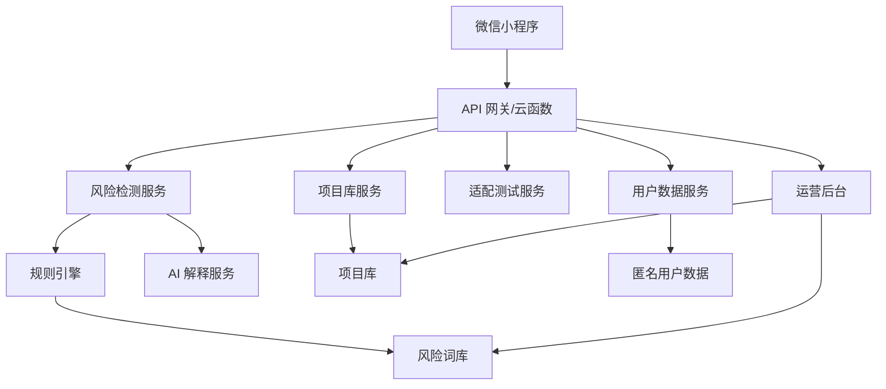
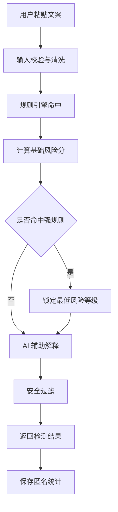
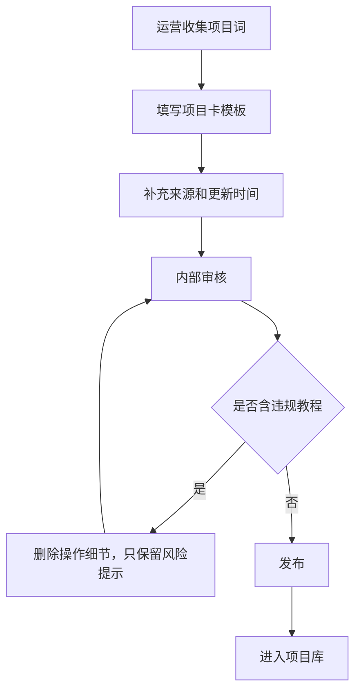

# 系统设计说明

## 1. 设计目标

系统需要支持一个免费工具型小程序：

- 用户能快速搜索副业/兼职项目风险卡。
- 用户能粘贴广告文案进行风险检测。
- 运营能持续维护项目库和风险词库。
- 后端能用规则引擎稳定输出风险等级。
- AI 只做辅助解释，不能绕过规则。
- 系统默认保护用户隐私，不保存敏感原文。

## 2. 总体架构

## 3. 模块划分

### 3.1 小程序前端

页面：

- 首页
- 项目搜索页
- 项目详情页
- 文案检测页
- 检测结果页
- 适配测试页
- 适配结果页
- 收藏/最近查看页
- 反馈页
- 关于与协议页

### 3.2 项目库服务

职责：

- 项目搜索。
- 别名匹配。
- 分类筛选。
- 热门项目排序。
- 项目详情查询。
- 相关推荐。

搜索策略：

- MVP 可先用数据库模糊查询 + aliases 字段。
- 后续可接全文检索。

### 3.3 风险检测服务

职责：

- 清洗用户输入。
- 命中风险关键词和组合规则。
- 计算风险分。
- 调用 AI 生成解释。
- 合并规则结果和 AI 解释。
- 输出结果。

检测流程：

### 3.4 AI 解释服务

职责：

- 对文案做语义风险补充。
- 把命中的规则解释成人话。
- 生成用户可执行的核实清单。

限制：

- AI 不决定最终风险等级。
- AI 不得降低强规则给出的风险等级。
- AI 不生成操作教程。

### 3.5 适配测试服务

职责：

- 根据用户答案计算用户画像。
- 推荐相对低风险、可验证的方向。
- 输出不建议碰的类型。

推荐逻辑：

- MVP 先用规则映射。
- 不使用 AI 生成随机推荐。
- 推荐项目必须来自项目库中状态为 `published` 且 `risk_level` 非 `extreme` 的项目。

### 3.6 运营后台

MVP 可不做完整后台，先用 JSON/CMS/数据库管理界面。  
但必须预留以下维护能力：

- 新增/编辑/下线项目卡。
- 新增/编辑/停用风险词。
- 查看用户反馈。
- 查看搜索无结果词。
- 查看检测误判样本统计。
- 查看项目卡更新时间。

## 4. 页面设计

### 4.1 首页

首屏结构：

1. 顶部标题：副业风险雷达。
2. 搜索框：`搜索副业/兼职，比如：小说推文、海外问卷、点赞日结`。
3. 主按钮：`粘贴文案测风险`。
4. 今日提醒：一条高危风险提示。
5. 热门查询词。
6. 风险榜单入口。

交互要求：

- 搜索框获得焦点后展示热门词和最近搜索。
- 热门词点击直接进入项目详情或搜索结果。
- 主按钮进入文案检测页。

### 4.2 项目搜索页

功能：

- 关键词搜索。
- 分类筛选。
- 风险等级筛选。
- 无结果时收集搜索词，并展示「提交给我们补充」。

搜索结果卡片：

- 项目名称。
- 风险等级标签。
- 一句话结论。
- 3 个主要风险点。
- 更新时间。

### 4.3 项目详情页

首屏必须包含：

- 项目名称。
- 风险等级。
- 风险分。
- 一句话结论。
- 不建议动作，例如「不建议垫资」「不建议购买高价课程」。

详情区块：

- 它靠什么赚钱。
- 真实门槛。
- 常见坑。
- 低成本验证方法。
- 红线提醒。
- 相关项目。
- 反馈不准确。

### 4.4 文案检测页

输入：

- 多行文本框，最多 2000 字。
- 来源平台选择：小红书/抖音/微信群/短信/招聘网站/其他。

校验：

- 少于 10 字提示输入更多信息。
- 超过 2000 字截断前提示用户。
- 连续提交需要限流。

### 4.5 检测结果页

展示：

- 风险分。
- 风险等级。
- 命中可疑点。
- 可能套路。
- 建议动作。
- 核实问题清单。
- 复制结果。
- 反馈不准确。

风险等级视觉：

- 低：绿色。
- 中：黄色。
- 高：橙色。
- 极高：红色。

### 4.6 适配测试页

结构：

- 8 道单选题。
- 每题最多 4 个选项。
- 进度条。
- 结果页输出推荐方向与不建议方向。

结果页必须出现提示：

> 推荐结果仅用于降低试错成本，不代表收益承诺。

## 5. 状态设计

### 5.1 项目卡状态

- `draft`：草稿。
- `reviewing`：待审核。
- `published`：已发布。
- `archived`：已下线。

### 5.2 风险词状态

- `enabled`：启用。
- `disabled`：停用。
- `testing`：测试中，仅后台可见。

### 5.3 用户检测记录状态

- `anonymous`：匿名统计。
- `saved`：用户主动保存。
- `deleted`：用户删除。

## 6. 规则引擎设计

### 6.1 单词规则

命中单个关键词后加分，例如：

- 垫资：+30
- 押金：+30
- 日结高薪：+20
- 陌生 App：+15

### 6.2 组合规则

组合规则优先级高于单词规则，例如：

- `刷单` + `返利/垫资/任务`：极高风险。
- `下载 App` + `充值/抢单`：高风险。
- `银行卡` + `刷流水/代收款`：极高风险。
- `拉人` + `团队/下线/裂变`：高风险。

### 6.3 风险分封顶

规则加分可以超过 100，但输出最高为 100。

### 6.4 等级锁定

如果强规则命中 `extreme`，即使 AI 认为中风险，最终仍为极高风险。

## 7. 数据更新流程

## 8. 灰度与风控

MVP 灰度阶段建议：

- 仅开放搜索、项目详情、文案检测。
- 不开放广告。
- 不开放前台反馈展示。
- 每日检查搜索无结果词。
- 每日检查高频误判。
- 每周更新项目库。

